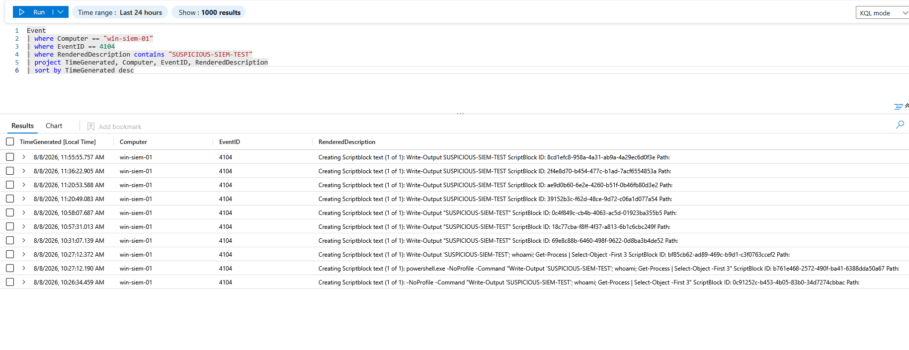
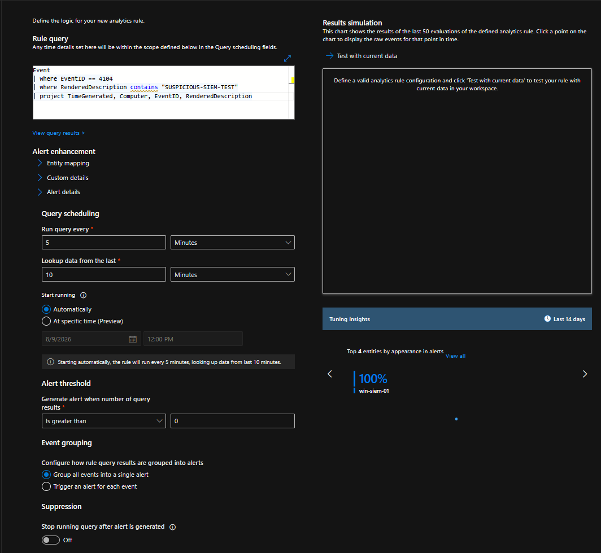
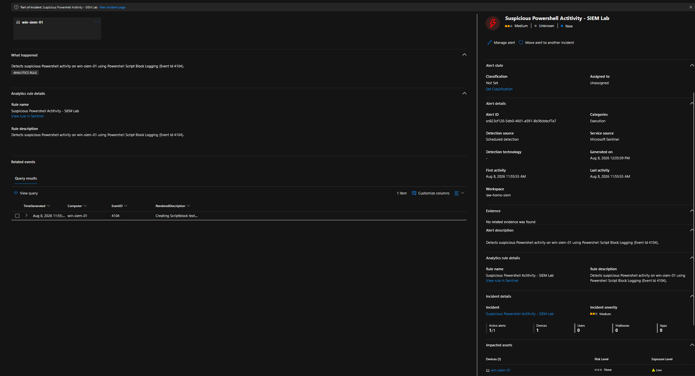
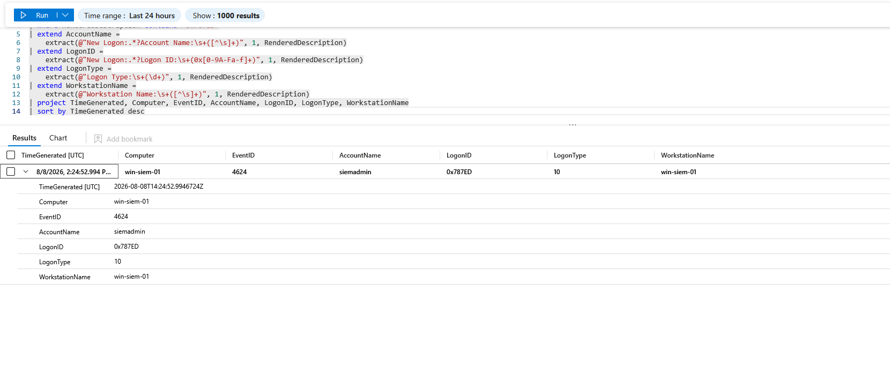
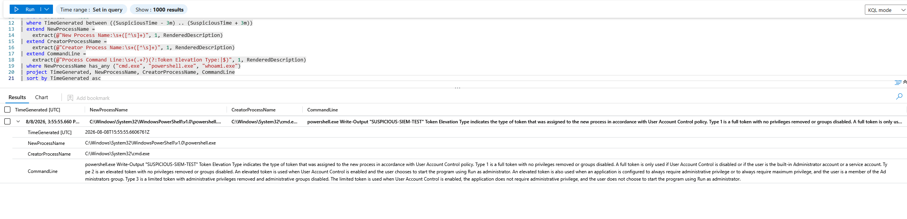
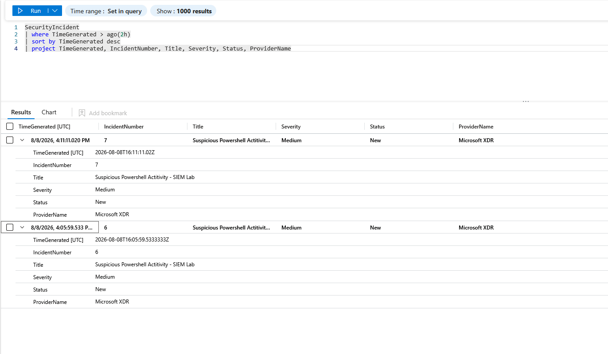

# Microsoft Sentinel SIEM Detection Engineering Lab

## Overview

This project demonstrates an end-to-end security monitoring and detection engineering workflow using Microsoft Sentinel, Microsoft Defender XDR, Windows Security telemetry, and Kusto Query Language (KQL).

I built a Windows-based SIEM lab, generated controlled PowerShell activity, ingested the resulting Windows events into Microsoft Sentinel, developed custom KQL detection logic, created a scheduled analytics rule, generated alerts and incidents, and investigated the activity using related authentication and process-creation telemetry.

### Detection Lifecycle

**Telemetry Collection → Detection Logic → Analytics Rule → Alert Generation → Incident Creation → Investigation → Correlation → Documentation**

---

## Lab Architecture

```text
Windows Endpoint (win-siem-01)
        |
        v
Windows Event Logging
        |
        v
Azure Monitor / Log Analytics
        |
        v
Microsoft Sentinel
        |
        v
Scheduled Analytics Rule
        |
        v
Microsoft Defender XDR
        |
        v
Alert / Incident
        |
        v
KQL Investigation & Event Correlation
```

## Technologies Used

- Microsoft Sentinel
- Microsoft Defender XDR
- Azure Log Analytics
- Kusto Query Language (KQL)
- Windows Security Event Logging
- PowerShell Script Block Logging
- Windows process creation auditing

## Relevant Windows Events

| Event ID | Purpose |
|---|---|
| **4104** | PowerShell Script Block Logging |
| **4624** | Successful account logon |
| **4688** | New process creation |

---

# Detection Engineering

## PowerShell Detection

A controlled PowerShell command containing the marker `SUSPICIOUS-SIEM-TEST` was executed on the monitored Windows endpoint.

PowerShell Script Block Logging generated Event ID **4104**, allowing the activity to be queried in Sentinel.

```kusto
Event
| where Computer == "win-siem-01"
| where EventID == 4104
| where RenderedDescription contains "SUSPICIOUS-SIEM-TEST"
| project TimeGenerated, Computer, EventID, RenderedDescription
| sort by TimeGenerated desc
```

The query successfully identified the generated PowerShell activity.



---

## Sentinel Analytics Rule

The detection query was converted into a scheduled Microsoft Sentinel analytics rule.

The rule was configured to:

- Execute every **5 minutes**
- Search the previous **10 minutes** of telemetry
- Generate an alert when matching events were found
- Group matching events into an alert
- Create incidents for investigation



This demonstrates the transition from an analyst-driven hunting query to an automated SIEM detection.

---

# Alert Generation

After the analytics rule detected matching Event ID 4104 telemetry, Microsoft Sentinel generated an alert for:

**Suspicious Powershell Activity - SIEM Lab**

The alert identifies the monitored Windows endpoint and preserves the underlying event used by the analytics rule.



At this stage, the workflow had progressed from raw telemetry to an actionable security detection.

---

# Incident Investigation

Detecting the PowerShell activity alone does not explain the surrounding activity. I therefore used additional Windows telemetry to reconstruct what occurred around the detection.

## Logon Correlation — Event ID 4624

Windows Event ID **4624** was investigated to identify authentication activity associated with the session.

The investigation extracted fields including:

- Account name
- Logon ID
- Logon type
- Workstation name
- Timestamp

The resulting telemetry identified the account associated with the session and provided a Logon ID that could be used for further correlation.



This demonstrates how authentication telemetry can provide additional context around an endpoint detection.

---

## Process Investigation — Event ID 4688

Windows Event ID **4688** was then used to examine process creation surrounding the suspicious PowerShell event.

The investigation identified the process relationship:

```text
cmd.exe
   |
   └── powershell.exe
          |
          └── Write-Output "SUSPICIOUS-SIEM-TEST"
```

The relevant event showed:

**New Process**
```text
C:\Windows\System32\WindowsPowerShell\v1.0\powershell.exe
```

**Creator Process**
```text
C:\Windows\System32\cmd.exe
```

**Observed command**
```text
powershell.exe Write-Output "SUSPICIOUS-SIEM-TEST"
```



This allowed the original PowerShell detection to be correlated with Windows process-creation telemetry rather than treating the alert as an isolated event.

---

# Incident Validation

The final stage was validating that the detection pipeline successfully created incidents.

The `SecurityIncident` table was queried:

```kusto
SecurityIncident
| where TimeGenerated > ago(2h)
| sort by TimeGenerated desc
| project TimeGenerated, IncidentNumber, Title, Severity, Status, ProviderName
```

Microsoft Sentinel returned incidents associated with the custom detection.

Observed incident properties included:

```text
Title:    Suspicious Powershell Activity - SIEM Lab
Severity: Medium
Status:   New
Provider: Microsoft XDR
```



This confirmed the complete detection pipeline was functioning successfully.

---

# Investigation Summary

The lab successfully demonstrated the following workflow:

```text
Controlled PowerShell Activity
          |
          v
PowerShell Event ID 4104
          |
          v
Microsoft Sentinel Ingestion
          |
          v
Custom KQL Detection
          |
          v
Scheduled Analytics Rule
          |
          v
Defender XDR Alert
          |
          v
Sentinel Incident
          |
          +------------------+
          |                  |
          v                  v
     Event 4624          Event 4688
  Authentication      Process Creation
          |                  |
          +--------+---------+
                   |
                   v
          Correlated Investigation
```

The investigation connected detection telemetry with authentication and process-creation events to provide additional context surrounding the alert.

---

# Skills Demonstrated

This project demonstrates hands-on experience with:

- SIEM deployment and monitoring
- Microsoft Sentinel
- Microsoft Defender XDR
- Kusto Query Language (KQL)
- Detection engineering
- Scheduled analytics rules
- Windows event log analysis
- PowerShell Script Block Logging
- Windows Event IDs 4104, 4624, and 4688
- Alert and incident investigation
- Authentication analysis
- Process-tree reconstruction
- Event correlation
- SOC investigation methodology
- Security documentation

---

# Repository Contents

```text
siem-detection-engineering/
│
├── README.md
│
├── queries/
│   ├── powershell-detection.kql
│   └── process-investigation.kql
│
└── evidence/
    ├── 01-powershell-4104-detection.png
    ├── 02-analytics-rule.png
    ├── 03-defender-alert.png
    ├── 04-logon-correlation.png
    ├── 05-process-chain.png
    └── 06-incident-validation.png
```

## Key Takeaways

This lab demonstrates that effective detection engineering extends beyond writing a query. A useful detection must collect the appropriate telemetry, identify meaningful activity, generate actionable alerts, create incidents, and provide enough context for an analyst to investigate the underlying behavior.

By correlating PowerShell Script Block Logging with authentication and process-creation events, I was able to move from a single detection to a broader reconstruction of the activity occurring on the monitored endpoint.
